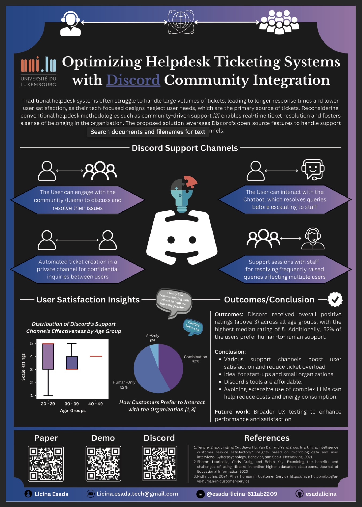

# Master Thesis Part 3: Towards an Interactive and Explainable Ticketing System Leveraging Large Language Models (LLMs)

This repository presents the third part of my thesis, introducing a novel approach to ticketing systems by integrating a Discord-based community with task-specific bots (such as ticket handling, a chatbot, and a voting bot). The proposed system leverages the open-source capabilities of the Discord platform to manage and process support requests directly within Discord channels, utilizing its real-time communication features and large community support. An initial evaluation of the system indicates that 88% of users are satisfied with the use of Discord, highlighting its potential to provide scalable solutions for various community-driven support scenarios. 

Master Thesis Part 1 - This repository involves preprocessing the dataset for the ticketing system to improve ticket classification through the evaluation and comparison of machine learning, deep learning, and large language models:

https://github.com/esadalicina/Part1--Towards-an-Interactive-and-Explainable-Ticketing-Systems-Leveraging-LLMs.git

Master Thesis Part 2 - The focus is on both the backend and frontend of the Ticketing System:

https://github.com/esadalicina/Part2--Towards-an-Interactive-and-Explainable-Ticketing-Systems-Leveraging-LLMs.git

## HAI24 Conference Poster - Optimizing Helpdesk Ticketing Systems with Discord Community Integration

HAI24 Conference Paper:

http://camps.aptaracorp.com/ACM_PMS/PMS/ACM/HAI24/55/ba221659-66d1-11ef-ada9-16bb50361d1f/OUT/hai24-55.html

